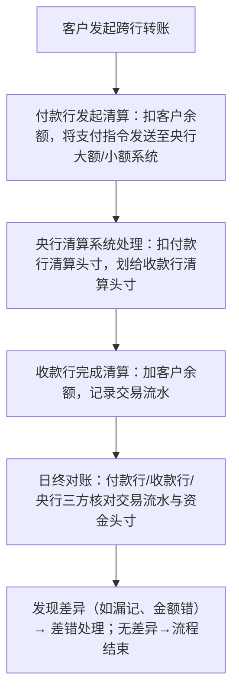

**清算**（Clearing）: 完成 “资金的实际划转” 和 “账务的初步记录”，解决 “钱从哪来、到哪去” 的问题
**对账**（Reconciliation）：校验 “清算后的资金流” 与 “账务记录” 是否一致，解决 “钱有没有送错、账有没有记错” 的问题

**从时间序列上看，清算一定发生在对账的前面**

# 清算和对账的过程

```mermaid
graph TD
    A[客户发起跨行转账] --> B[付款行发起清算：扣客户余额，将支付指令发送至央行大额/小额系统]
    B --> C[央行清算系统处理：扣付款行清算头寸，划给收款行清算头寸]
    C --> D[收款行完成清算：加客户余额，记录交易流水]
    D --> E[日终对账：付款行/收款行/央行三方核对交易流水与资金头寸]
    E --> F[发现差异（如漏记、金额错）→ 差错处理；无差异→流程结束]
```