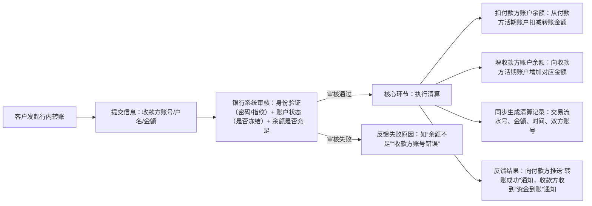

# 行内转账流程

```mermaid

graph LR
    A[客户发起行内转账] --> B[提交信息：收款方账号/户名/金额]
    B --> C[银行系统审核：身份验证（密码/指纹）+ 账户状态（是否冻结）+ 余额是否充足]
    C -->|审核通过| D[核心环节：执行清算]
    D --> D1[扣付款方账户余额：从付款方活期账户扣减转账金额]
    D --> D2[增收款方账户余额：向收款方活期账户增加对应金额]
    D --> D3[同步生成清算记录：交易流水号、金额、时间、双方账号]
    D --> E[反馈结果：向付款方推送“转账成功”通知，收款方收到“资金到账”通知]
    C -->|审核失败| F[反馈失败原因：如“余额不足”“收款方账号错误”]
```

